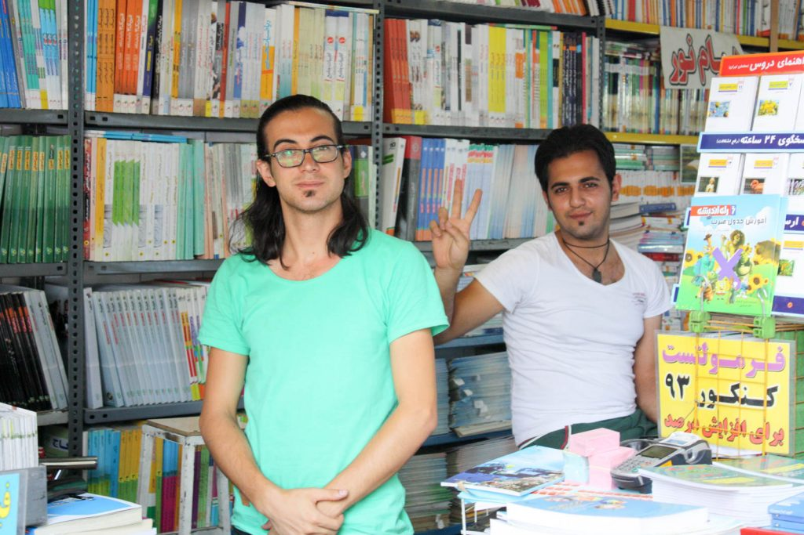
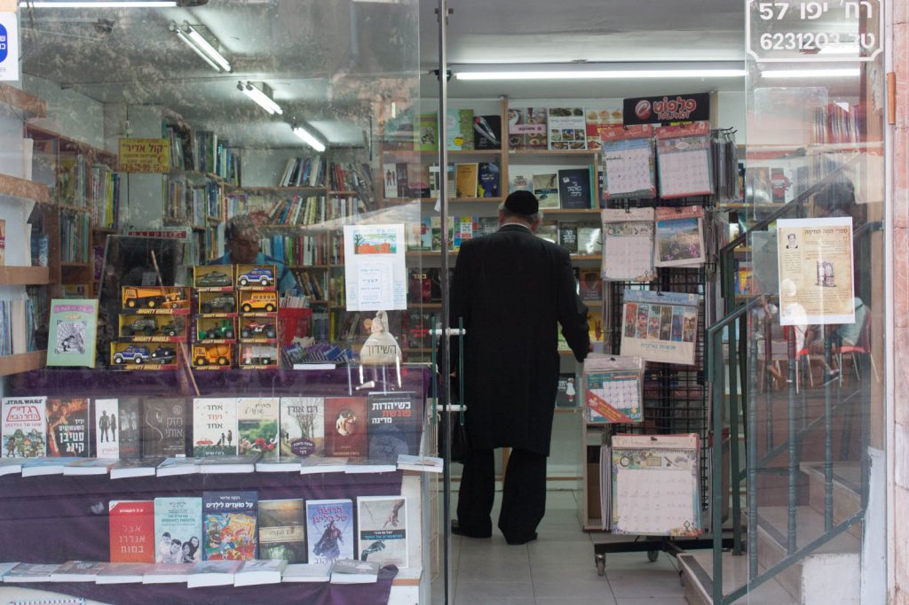
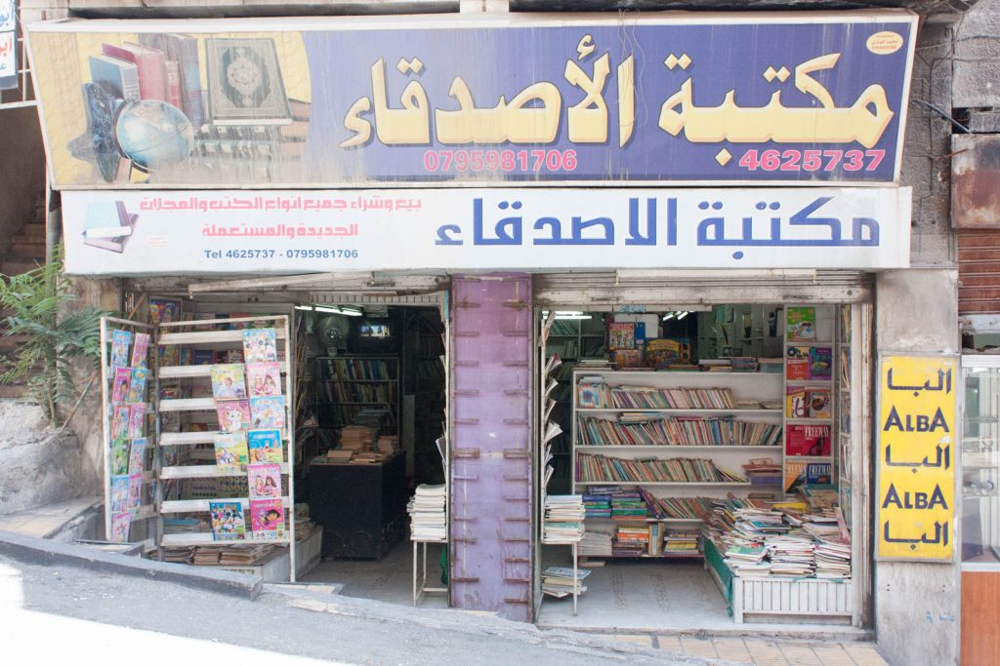
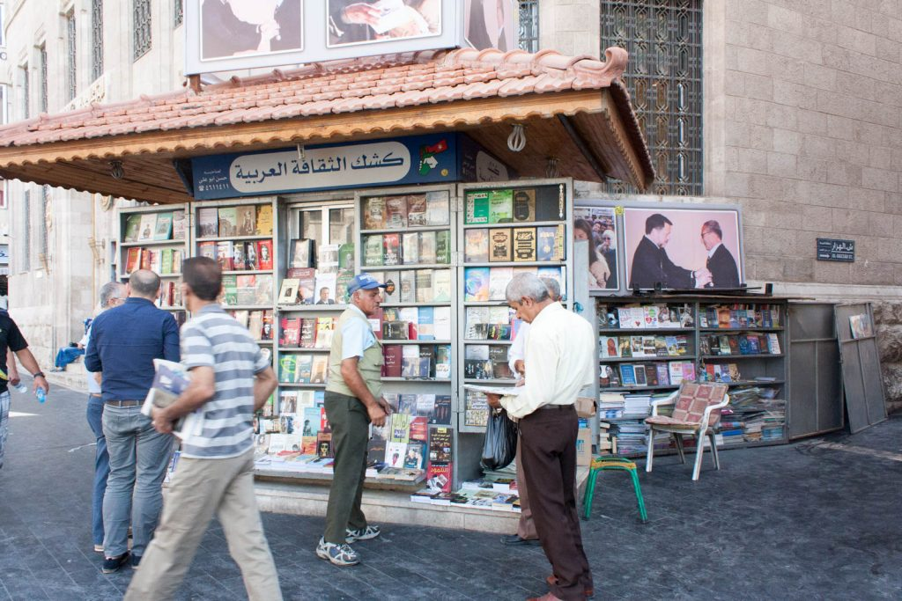

import AmazonCard from "../../components/AmazonCard.astro";

<figure>

<figcaption>

イランの書店員

</figcaption>

</figure>

イスラム教、ヘブライ教の国が多い中東では聖典を読む機会が多いからか、本屋さんが多くあります。ほとんどがアラビア語、ペルシャ語、ヘブライ語の出版物なので相当勉強した人でないと読めません。旅行者には不便ですが、これだけの出版文化がまだ維持されているのはさすが四大文明の生まれたところと感じます。

- [イスラエル](#israel)
- [イラン](#イラン)
- [ヨルダン](#jordan)

## イスラエル

イスラエルではエルサレムの新市街、路面電車の走っているメインストリート沿いに本屋を見かけます。ほとんどヘブライ語っぽかったのであまり調べてはいませんが、本に困れば英語、ドイツ語であれば手に入れることはできそうです。

## イラン

イランではまだそこまで西洋化が進んでいないからか、それともコーランをよく読むお国柄だからか、書店は割と見かけます。諸外国ではあまり見かけなくなった絵葉書も多くあります。特にテヘランではテヘラン大学周辺に教科書や参考書を売る書店のほか、古本を売る屋台もあります。ほとんどペルシャ語なのはご愛嬌。

<figure>

<figcaption>

古本の露天 真ん中にはヒトラーの[『わが闘争』](https://www.amazon.co.jp/gp/product/B01B41OFQS/ref=as_li_tl?ie=UTF8&camp=247&creative=1211&creativeASIN=B01B41OFQS&linkCode=as2&tag=dai5986-22&linkId=e46f461ca85e9715fb1a2dffa53a4471)

</figcaption>

</figure>

<figure>

<figcaption>

本がぎっしりイランの書店

</figcaption>

</figure>

## ヨルダン

ヨルダンではアンマンの市街地や市場で本をよく見かけます。本を売っているおじさんたちは英語で話してくれると思います。売っている本は大半がアラビア語です。

<figure>

<figcaption>

ヨルダンの書店  

</figcaption>

</figure>

<figure>

<figcaption>

ヨルダンの書店

</figcaption>

</figure>
