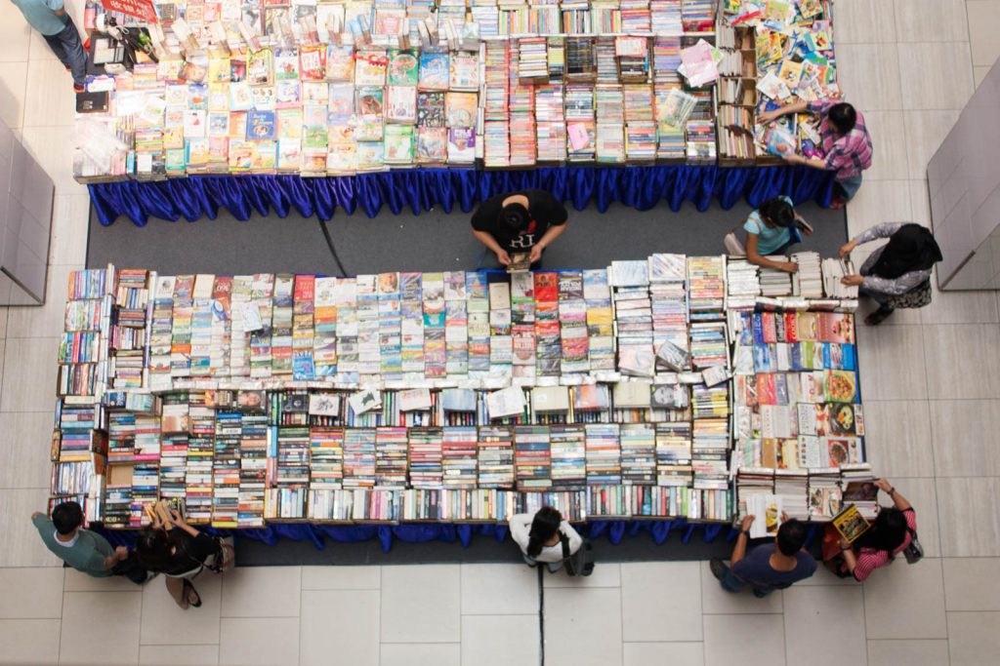
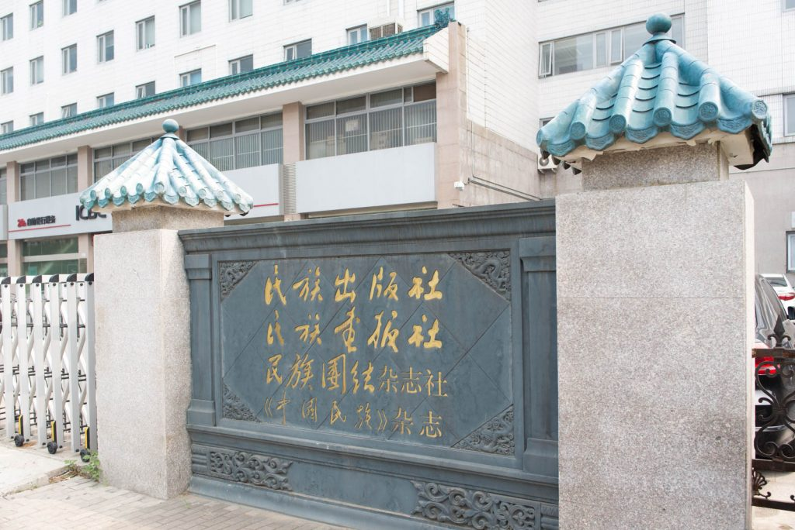

import AmazonCard from "../../components/AmazonCard.astro";

<figure>

<figcaption>

中国の書店

</figcaption>

</figure>

中国の書店といえば国営新華書店です。大規模だし品数も多いです。おそらく最大のものは北京の西単にある大書城でしょう。2010年代前半に行ったときは店内に耳の聞こえない人たちのための募金を集める人たちがいましたが、いまはそういう寄付金詐欺まがいの人たちはいなくなりました。

中国は経済大国になったとはいえ、日本と比べると物価は安いです。しかも印刷物は版を作るのが高く、刷るのは安いので大量印刷するほうが1冊あたりの単価が安上がりになります。物価安な上に大量に印刷する中国では必然的に本はかなり安くなります。

古典や辞書のたぐいはたくさん出ているし安価で買えます。ただほぼ全て簡体字なので、慣れないと違和感があります。そもそも漢文を簡体字で読む必要性も感じられませんし…。

新華書店は国営の書店だけあって、党大会のあとは報告書が平積みされる一方でほんとうの意味で面白い本は出回っていません。ちゃんと在庫管理がされています。

新華書店の他にも独立系の書店もあります。北京だと万聖書園や三聯韜奮が有名です。近年は当局の締付けが厳しく、いつまで生き残れるかわかりません。ただ、これらのお店には新華書店とは違った品揃えの本が置いてあって興味深いです。

<figure>

<figcaption>

独立系書店の一つ、PAGEONE。おしゃれ系本屋

</figcaption>

</figure>

その他、中国では大学等が出版部門を持っているため、北京語言大学には語学書が、中国社会科学院には社会科学関連書が揃った書店が、民族出版社の書店には各民族の言語で書かれた本まであります。また、古本屋といえば中国書店が有名チェーンです。北京市中心部にはあまりないですが、少し郊外に行くとあります。

<figure>

<figcaption>

民族出版社

</figcaption>

</figure>

ただ、本に限ったことではありませんが、中国では国土が広大で移動が大変なこともあり、ネットショッピングがものすごい勢いで広まっています。おそらく国営の新華書店や研究機関、出版社付属書店は大丈夫かと思いますが、それら以外の民間の書店が経営的にいつまで生き残れるのかは不透明です。
