import AmazonCard from "../../components/AmazonCard.astro";

https://www.youtube.com/watch?v=5Y-399k7vLs

2019年1月7日から10日にかけて、北朝鮮の金正恩 国務委員会委員長が中国を訪問、習近平 国家主席と会談しました。その訪中のようすが北朝鮮国営メディアである朝鮮中央放送で流れました。以下ではその詳細を見ていきたいと思います。

## 1月7日午後

00:04

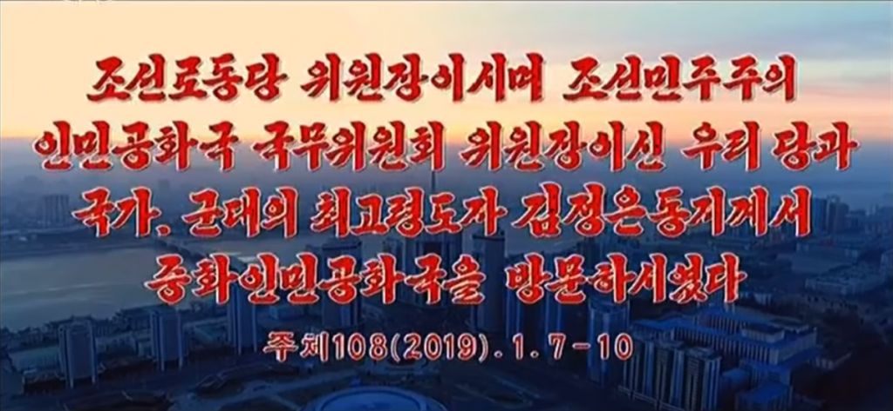
タイトル「朝鮮労働党委員長であらせられ朝鮮民主主義人民共和国国務委員会委員長であらせられるわが党と国家、軍隊の最高領導者金正恩同志におかれては中華人民共和国を訪問なさった 主体108（2019）.1.7-10」

00:39

左に見える赤いビル、広いプラットフォームから、出発駅はおそらく龍城（リョンソン）駅です。

00:47

金永南首相（右端）をはじめとする幹部たちがお出迎えのために待機しています。午後とはいえ、寒い中、大変です。後ろで脚立に乗って望遠レンズを構えているカメラマンが女性です。北朝鮮公式メディアのカメラマンはたいてい男性なので珍しいです。

01:15

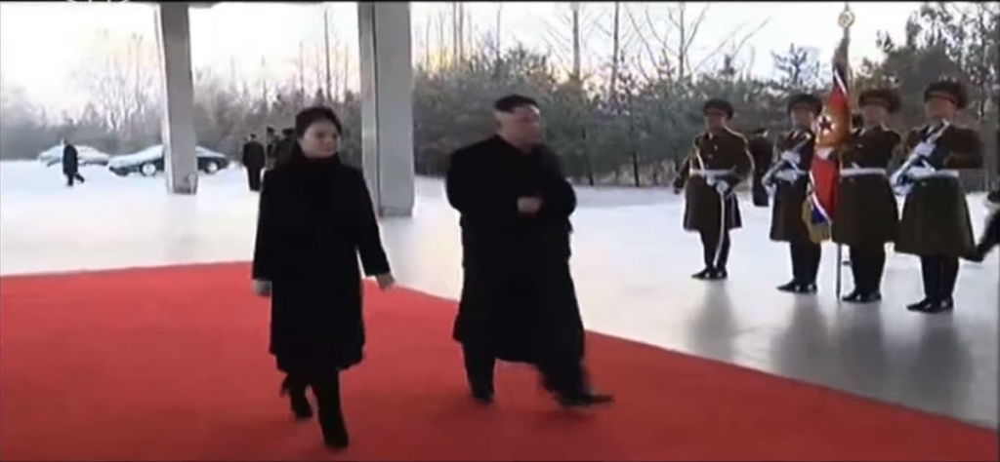
金正恩・李雪主夫妻が駅に入ってきて、見送りの幹部たちに挨拶をします。

02:40

幹部たちが深々とお辞儀をする中、専用列車の開け放った扉から手を振る将軍様。照明がすごい。

02:47

手を振る将軍様の右後ろにいるのが妹の金与正という報道もありました。

03:00

最後尾あたりにある車両、妙にゴツゴツしています。通信機器が載っているのでしょうか。今回の訪問には李洙墉、金英哲、朴泰成、李容浩、努光鉄、李一煥（部長）、崔東明（部長）を始めとする人々が同行しました。

## 1月8日

04:13

丹東駅に到着、宋濤 中国共産党対外連絡部長の出迎えを受けます。左端の花束を金正恩から受け取るために待機している金与正も見えます。

04:43

列車内で会談をします。いわく「和気あいあいとした雰囲気」で行われたそうです。

06:23

現地時間1月8日午前10時半、北京に到着しました。映像では午前11時頃到着したようです。

06:40

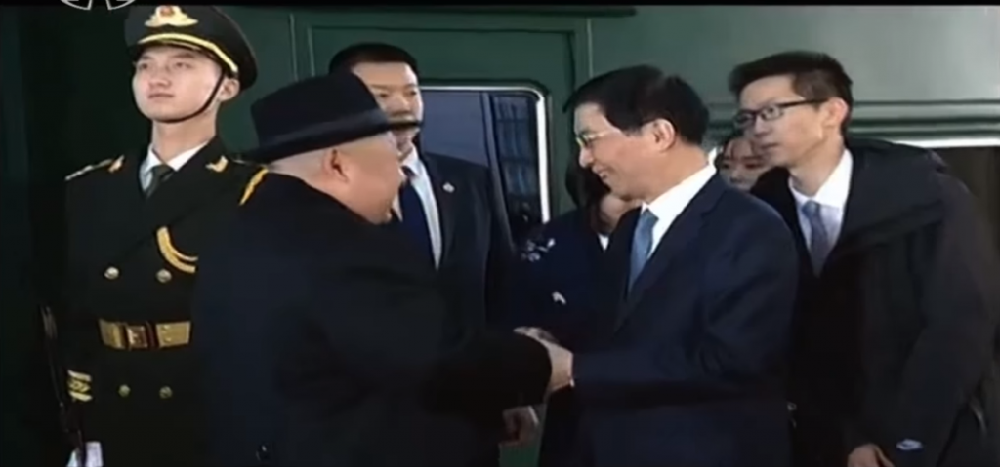
北京駅で王滬寧 中国共産党中央政治局委員と蔡奇 北京市党委員会書記が出迎えます。その後、天安門の前にある長安街を通って釣魚台迎賓館に移動します。

09:10

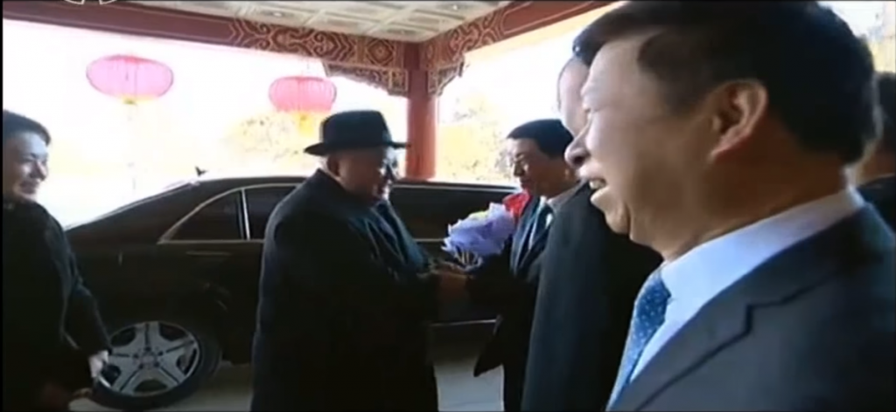
宿泊先となる釣魚台迎賓館で王滬寧 中国共産党中央政治局委員と蔡奇 北京市党委員会書記、宋濤 中国共産党対外連絡部長が出迎えます。前二者は北京駅で、宋濤は未明に丹東駅で出迎えています。どうやって先回りしたんでしょう？　丹東からは高速鉄道や飛行機を使えば先回りできますが。

10:27

8日午後5時半、習近平・彭麗媛が人民大会堂にて金正恩・李雪主夫妻を出迎えます。

12:17

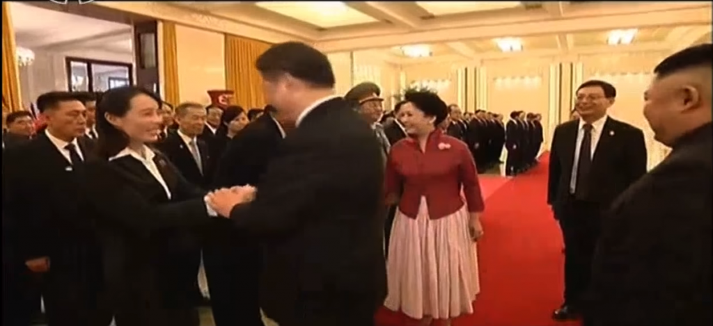
金正恩と習近平がそれぞれの政権幹部たちに挨拶をします。習近平は他の幹部とは片手で握手しましたが、金与正とだけは両手で握手をしています。重要人物であることが伺えます。

13:46

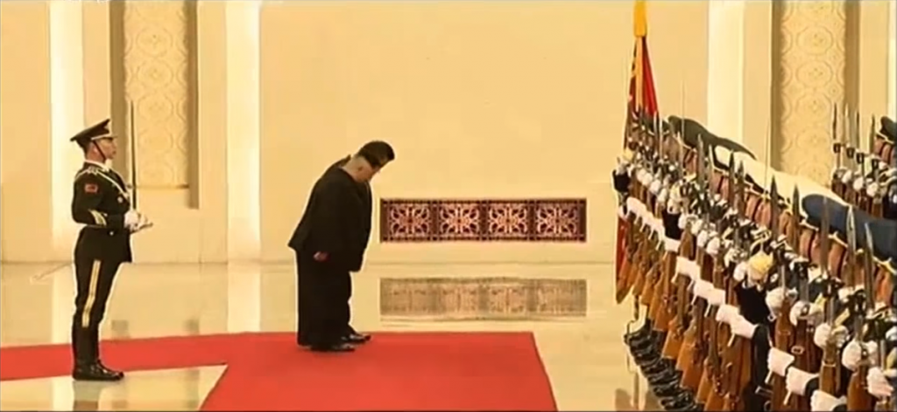
儀仗隊の閲兵式が人民大会堂の中で行われました。冒頭に国旗に一礼した習近平、金正恩の両国指導者。

15:42

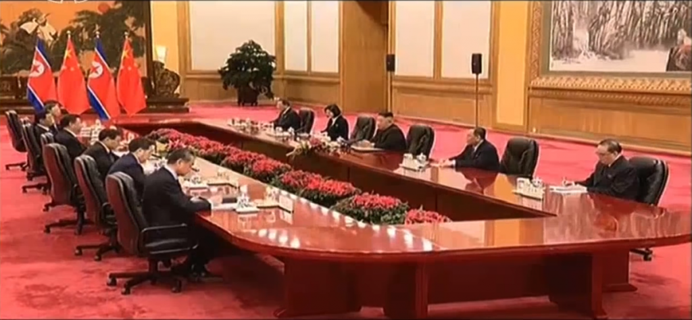
首脳会談の様子です。北朝鮮側は金正恩、李洙墉、金英哲、李容浩が、中国側は習近平、王滬寧、丁薛祥、楊潔チ、王毅、宋濤が参加しました。

23:28

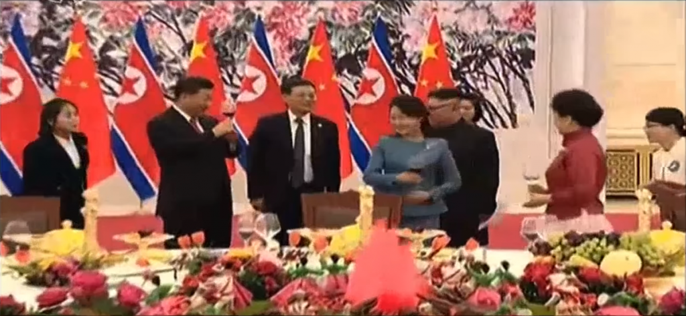
習近平の主催で歓迎式典が開催されました。場所は人民大会堂です。

34:25

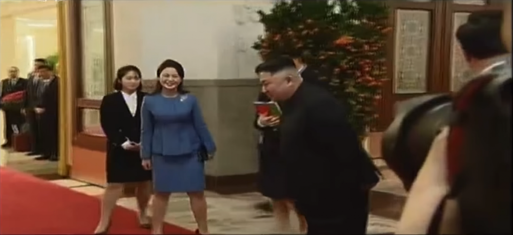
習近平、金正恩が挨拶のスピーチを行い、出し物がありました。宴も酣のうちに終了しました。最後に金正恩は習近平に一礼します。礼儀正しいですね。

## 1月9日

35:22

午前、漢方薬製造企業である北京同仁堂のため、宿舎である釣魚台迎賓館を出発します。お出迎えに来たのは王滬寧と宋濤。

36:28

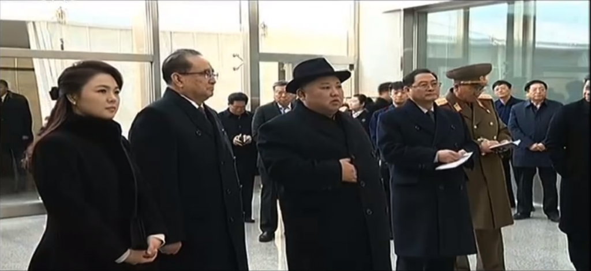

漢方薬製造企業である北京同仁堂を見学します。製造方法や経営状況についての説明を受けたようです。

38:11

満足して帰ります。帽子をとって挨拶をします。出口には目隠しのテントが張ってあります。

39:00

一度、宿舎である釣魚台迎賓館に戻ります。スタッフに挨拶をして、再度出発します。

39:40

北京飯店に行き、習近平と最後の首脳会談を行います。首脳会談のあとは午茶（アフタヌーンティー）を楽しみました。「家庭的な雰囲気」の中、行われたそうです。

43:09

午後3時、北京駅から帰途に就きます。お見送りには王滬寧 中国共産党中央政治局委員と蔡奇 北京市党委員会書記、宋濤 中国共産党対外連絡部長が来ました。将軍様の隣で顔を出す存在感のある女性は通訳（おそらく）です。

## 1月10日

43:36

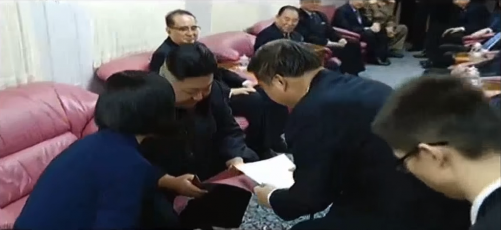
深夜、丹東駅に到着し、列車内で宋濤 中国共産党対外連絡部長や鉄道部幹部と会談を行います。車内で習近平に宛てた親書を宋濤に渡します。北京から丹東まで高速鉄道でも6時間ほどかかるので、客車ならもっと夜遅くになったでしょう。北京駅で見送ったのにさらに国境まで見送りに来た宋濤は大変だったと思います。

44:33

お互い抱き合ってお別れです。また会うことを約束します。感動的なシーンです。金正恩の右奥には金与正の姿も見えます。6号車が専用車である可能性が一番高いですね。

45:29

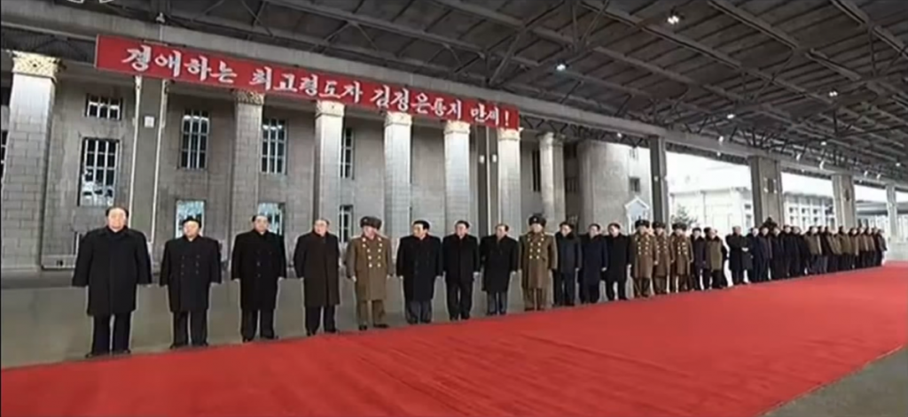
行きとは違い、帰りは平壌駅に到着します。駅には「敬愛する最高領導者金正恩同志万歳！」というスローガンがかかっています。

48:00

午後3時、列車が到着します。金永南を始めとする幹部たちの出迎えを受けます。老人は口が臭いから手で覆うように、という指導を守る幹部も散見されます。

48:30

専用車で平壌駅を出発します。これにて、一連の中国訪問は終わりました。
