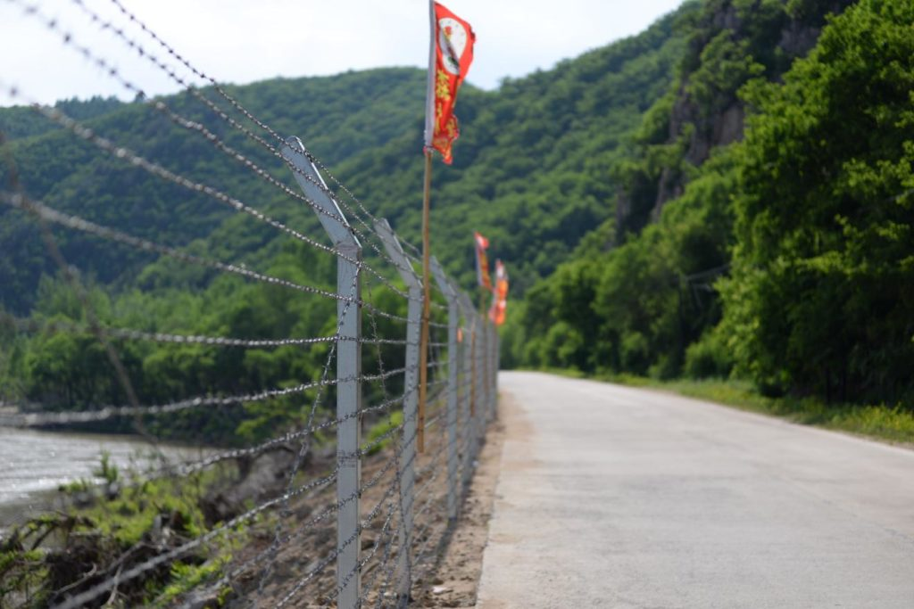

import AmazonCard from "../../components/AmazonCard.astro";

> すでに7時間は過ぎていた。トイレに行くたびに取調官がついてくる。慣れているとはいえ、中国語での事情聴取は思った以上に神経をすり減らした。
> 
> 本書 p.32

> 「落ち着いて聞いてほしい、将軍がなくなった。しかも数日前のようだ。」  
> （中略）いつも冷静な人物が焦っている。すぐに確認に走ると、2日前の12月17日朝に死去していたことが確認できた。  
> 　12月19日正午、朝鮮中央放送が金正日の死去を伝える特別放送を流した。
> 
> 本書 p.177

> 特に朝日新聞の中国報道について、「親中的」だという批判は根強い。1960年代の文化革命期に（中略）朝日新聞は当時の社長が「歴史の目撃者になるべきだ」として、追放されるような記事を書かないよう北京特派員に指示。当局に都合の悪いことは書かず、北京に残り続けた。
> 
> 本書 p.238

朝日新聞記者だった著者が2000日にわたる中国特派員時代のうち、主にその成功談を書いたものです。最近は朝日新聞の記者だからと言って中国も手を緩めてはくれない様子がよくわかります。

しかし、著者は一般客に紛れるために鈍行列車に乗り、5つ以上の携帯電話を使い分け、時には変装をして取材に臨んだ結果、中国の奥深くに入ることができました。その結果、上にあるように金正日の死去は朝鮮中央放送の特別放送より前に知ることができました。アントニオ猪木ですら10分程度前にしか知らなかったというので、中国での情報網の太さが分かります。

北朝鮮の当時の指導者、金正日訪中をめぐる取材は執念とも言えます。北京国際空港で平壌発の北朝鮮国営高麗航空のタラップから降りてくる朝鮮労働党幹部（おそらく崔龍海か？）を確認し、過去の例から考えてその約2～4週間後に金正日が訪中すると踏みました。そしてまさに1か月後、金正日は訪中し、その幹部が下見したホテルに泊まりました。植え込みから撮影していた著者と共同通信のカメラマンは撮影後拘束され、写真の消去を命じられました。共同通信のカメラマンは何とか切り抜け、写真を報じ、2010年の新聞協会賞を受賞しました。

<figure>

<figcaption>

図們市外の中朝国境にある鉄条網

</figcaption>

</figure>

著者は北朝鮮の国境地帯に行っては十数メートルの距離で兵士を撮影し、銃を構えかけられたりなど、無礼にも見える取材をしています。しかし北朝鮮と中国の国境では韓国人や中国人が缶詰やカップ麺を投げ、それを取りに来る北朝鮮の人々を見て楽しむ「人間サファリツアー」をやっていることを苦々しく書いています。

<figure>

<figcaption>

あなたはすでに国境区域に入っています。自覚して国境の法規を遵守してください。

</figcaption>

</figure>

著者は本書末尾に新聞記者を続けるようなことを書いていますが、「週刊ダイヤモンド」に掲載する予定だった安倍晋三元首相へのインタビューを事前に見せるよう迫るなどし、退職目前に控えて1か月の停職処分となりました。今は青山学院大学の客員教授をしています。

本書は成功談の断片が多く、面白いですが、やはり同じ著者の『[十三億分の一の男 中国皇帝を巡る人類最大の権力闘争](https://amzn.to/3yWiglI)』のほうが断然面白く読めました。

